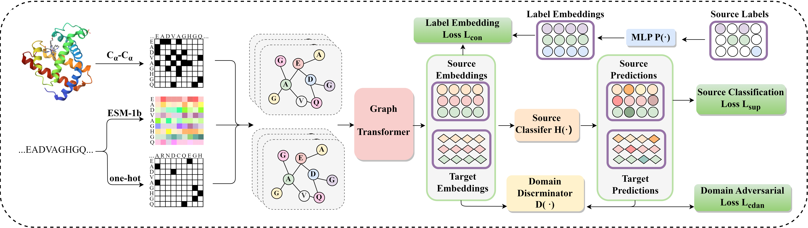

# Learning A Generalized Graph Transformer for Protein Function Prediction in Dissimilar Sequences
---
## Overview
In this work, we propose a new generalized approach named Graph Adversarial Learning with Alignment (GALA) for protein function prediction. To encode all these proteins from different environments, our GALA utilizes a graph Transformer architecture with the attention mechanism for unified protein representations. More importantly, GALA introduces a domain discriminator conditioned on both representations and predicted labels, which is adversarially trained to ensure the invariance of representation across different environments. To make the best of label information, we generate label embeddings in the hidden space, which would be aligned explicitly with protein representations. We conduct extensive experiments on various benchmark datasets and our GALA can outperform all the compared baselines with high generalizability.                        

## Installation
Start by following this source codes:
```bash
git clone https://github.com/fuyw-aisw/GALA.git
cd GALA
conda create -n gala python=3.7
conda activate gala
## step1: install PyTorch’s CUDA support on Linux
pip install torch==1.7.1+cu110 torchvision==0.8.2+cu110 torchaudio==0.7.2 -f https://download.pytorch.org/whl/torch_stable.html
## step2: download dependencies
pip install -r requirements.txt
## step3: install pyg package
pip install torch_scatter torch_sparse torch_cluster torch_spline_conv torch_geometric -f https://data.pyg.org/whl/torch-1.7.1%2Bcu110.html ### GPU
## step3: or install by the following source codes
pip install https://data.pyg.org/whl/torch-1.7.0%2Bcu110/torch_cluster-1.5.8-cp37-cp37m-linux_x86_64.whl
pip install https://data.pyg.org/whl/torch-1.7.0%2Bcu110/torch_scatter-2.0.5-cp37-cp37m-linux_x86_64.whl
pip install https://data.pyg.org/whl/torch-1.7.0%2Bcu110/torch_sparse-0.6.9-cp37-cp37m-linux_x86_64.whl
pip install https://data.pyg.org/whl/torch-1.7.0%2Bcu110/torch_spline_conv-1.2.1-cp37-cp37m-linux_x86_64.whl
pip install torch_geometric==1.6.3
```
## Protein Function Prediction
To predict protein functions use `predict.py` script with the following options:
* `device`             str, choose the available cuda
* `task`            str,  default='bp', choose from three gene ontology tasks ['mf','bp','cc']
* `pdb`             str, path of the input query pdb file
* `only_pdbch`   str2bool, default=False, True means use the model parameters trained only on PDBch training set, False means use the model parameters trained on PDBch and AFch combined training set
* `prob`  float, default=0.5, choose a threshold, and then output the protein function with predicted probability above the threshold
### Predicting functions of protein 1P4U-A on BP-GO term:
```bash
python predictor.py --device 0 --task bp --pdb data/1P4U-A.pdb --only_pdbch False --prob 0.5
```
### output
```txt
The protein may hold the following functions of BP:
Possibility: 0.9 ||| Functions: GO:0071702, organic substance transport
Possibility: 0.95 ||| Functions: GO:0046907, intracellular transport
Possibility: 0.83 ||| Functions: GO:0016192, vesicle-mediated transport
Possibility: 0.92 ||| Functions: GO:0071705, nitrogen compound transport
Possibility: 0.99 ||| Functions: GO:0051179, localization
Possibility: 0.92 ||| Functions: GO:0015031, protein transport
Possibility: 0.88 ||| Functions: GO:0006886, intracellular protein transport
Possibility: 0.8 ||| Functions: GO:0070727, cellular macromolecule localization
Possibility: 0.99 ||| Functions: GO:0051234, establishment of localization
Possibility: 0.92 ||| Functions: GO:0045184, establishment of protein localization
Possibility: 0.93 ||| Functions: GO:0051641, cellular localization
Possibility: 0.99 ||| Functions: GO:0006810, transport
Possibility: 0.94 ||| Functions: GO:0051649, establishment of localization in cell
Possibility: 0.9 ||| Functions: GO:0008104, protein localization
Possibility: 0.81 ||| Functions: GO:0034613, cellular protein localization
Possibility: 0.9 ||| Functions: GO:0033036, macromolecule localization
Possibility: 0.92 ||| Functions: GO:0015833, peptide transport
Possibility: 0.92 ||| Functions: GO:0042886, amide transport
```
## Model Training
### Data preparation
Our dataset can be downloaded from [here](https://disk.pku.edu.cn:443/link/E5DFEA3B9F95E679F76DEC9061872BB2).
```bash
unzip prot30.zip -d ../GALA/data/
```
The dataset related files will be under `../GALA/data/prot30`. 
Files with prefix of `AF2` belong to AFch dataset, others belong to PDBch dataset.
Files with suffix of `pdbch` record the PDBid or uniprot accession of each protein, and files with suffix of `graph` contain the graph we constructed for each protein.  
```txt
AF2train_graph.pt  AF2val_graph.pt  AF2test_graph.pt  train_graph.pt  val_graph.pt  test_graph.pt
AF2train_pdbch.pt  AF2val_pdbch.pt  AF2test_pdbch.pt  train_pdbch.pt  val_pdbch.pt  test_pdbch.pt
```
#### As for *.graph.pt:
*`edge_index`, edge index of residue pairs whose $C_\alpha$ are within 10 angstroms
*`native_x`, residues of each protein 
*`x`, ESM-1b embedding for each residue
### To retrain the model:
```bash
python train.py --task mf --suffix sort_by_id_mf__AF2 --device 0 --esmembed True --AF2model True --batch_size 64 --method CDAN-E --alpha 0.05 --gamma 1
```
* `device`      str, choose the available cuda
* `task`            str,  default='bp', choose from three gene ontology tasks ['mf','bp','cc']
* `suffix`             str, the suffix of the file name for the trained model
* `esmembed`   bool, whether to use ESM-1b language model
* `pooling`   str, pooling layer for graph transformer
* `AF2model` str, whether to use AF2model for training
* `batch_size`  int, sample size for a batch
* `method` str, method for domain alignment
* `random` str, whether to randomized multilinear map of feature embedding and predicted probability
* `alpha` str, weight of loss
* `gamma` str, weight of loss
## Model Testing
### To test the model on the test set:
```bash
python test.py --task mf --device 0 --esmembed True --model sortedmodel/model_mfsort_by_id_mf_AF2.pt
```
* `model`      str, the path of the trained model
* `AF2test`    bool, whether to use AFch set for testing
